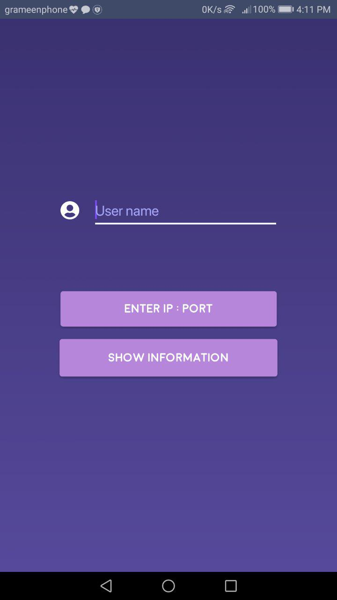
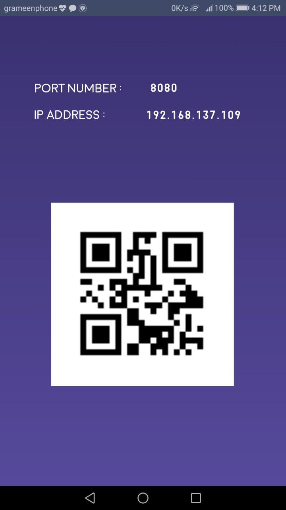
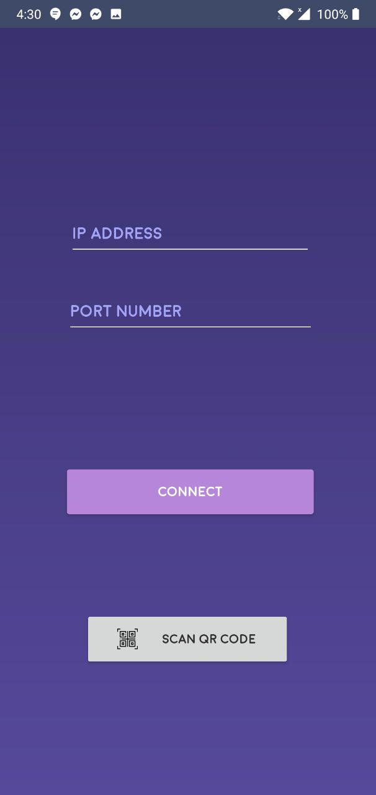
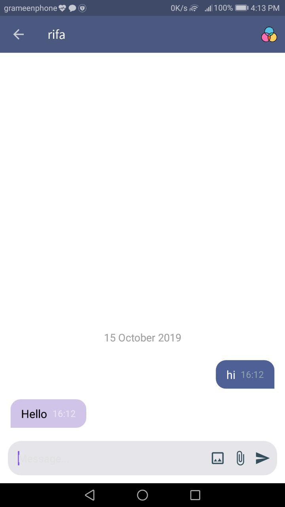
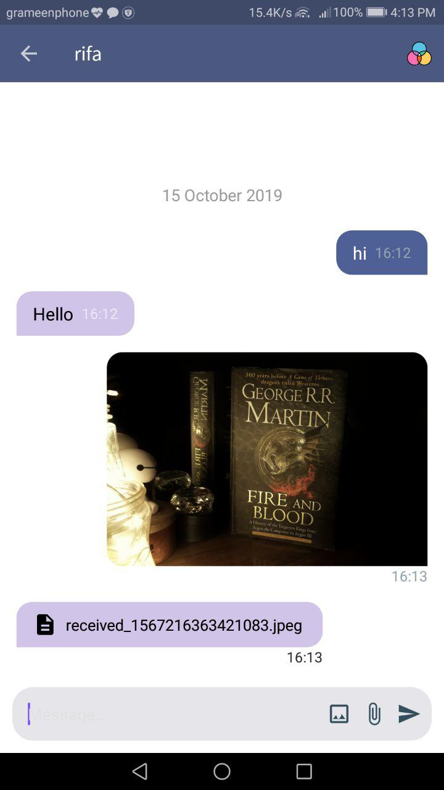
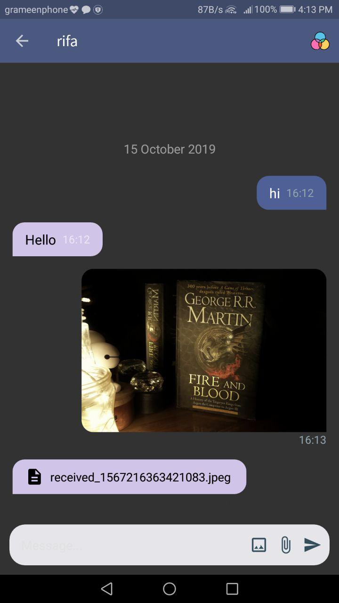

# Android P2P ChatSock Application using JAVA Socket

This is a chat application which allows text messaging and files sharing using JAVA Socket

## Features
 - Text messaging 
 - File sharing (any type of file including text, raw image, doc, pdf etc.)
 - Image sharing
 - Connect using QR Code Scanner
 - Set background color dynamically with custom color picker.
 - Show image thumbnail in chat.
 - Dynamic online or offline status update of opposite user.
 - Chat is saved upon exit or going out of scope automatically. Manual saving not necessary. The history is loaded from memory using "Username+IP Address+Port" of the user. Change in either of these values will be detected as a different user.
 - Chat is loaded dynamically to save memory consumption. Instead of loading entire message history at once, as the user scrolls up to see history, previous messages are loaded dynamically.

## Demo
   

 

## Instructions

  1. First Connect both the devices to same wifi network.
  2. Set username. <strong>Username is CASE-SENSITIVE</strong>. Username is used to store messages.
  3. Click the "Show Information" button in one device.  
  4. Click "Enter IP:Port" button in another device.  
  5. Scan The QR Code & click connect button.  
  6. Or enter ip address and port number manually.  
  7. Start messaging.
  

